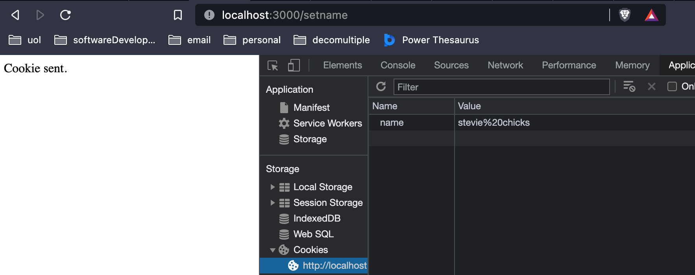

# Cookies
In the express docs, under 'Response', you'll find: 


The way you send a cookie with express is as part of the `res` object with the `res.cookie` method which allows us to pass in a **name** and a **value**. 

```Javascript
app.get('/setname', (req, res)=> {
    res.cookie('name', 'stevie chicks');
    res.send(`<p>Cookie sent.</p>`)
})
```


[Source: express docs](https://expressjs.com/en/5x/api.html#res.cookie)

Now, to access the information stored in the cookie, we need to access it through  `req.cookie` as express turns the data into an object contained in the request object. Unfortunately, express does not parse cookies out of the box, for that we can use `cookie-parser` => `npm install cookie-parser`.

[npm cookie-parser](https://www.npmjs.com/package/cookie-parser)

## Signing cookies
> Optionally you may enable *signed cookie* support by passing a `secret` string, which assigns `req.secret` so it may be used by other middleware.

Signing a cookie means taking a cookie and passing it through cookie-parser to 'sign it', basically encrypt it when sent to the client, then it will sent back to the server, where cookie-parser will be able to tell us if any of those cookies have been **tampered with** because they *won't match*. 
Signing is a way of making sure that the original data that we sent to the client through the browser is the same data that is being sent back to the server. 
If we want `cookie-parser` to parse our signed cookie, we must specify that it is signed, setting `{ signed: true }`, in this case,  as a third argument in the `res.cookie` response. 
```Javascript
app.get('/getsignedcookie', (req, res) => {
    res.cookie('fruit', 'grape', { signed: true })
})
```

To access signed cookies, we need to look inside `req.signedCookies` instead of `req.cookies`, this is by design to show intent, to prevent malicious cookie attacks. 
